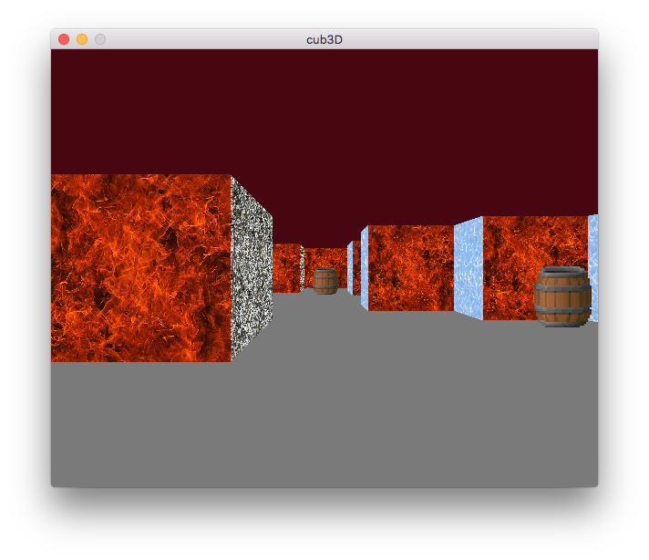
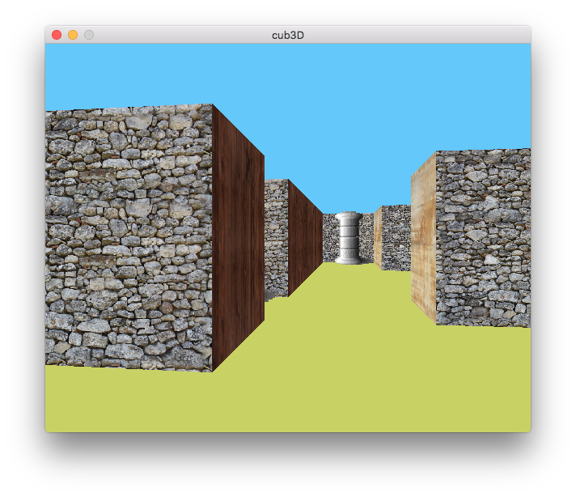
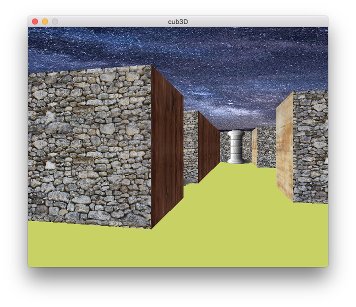
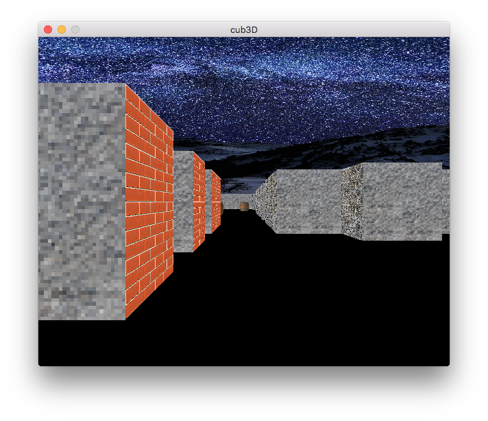

# Cub3D

This project relates to the Codam Core curriculum.
Codam is part of the #42network, with 9.000 students around the world.


## Project overview

>Summary: This project is inspired by the world-famous eponymous 90’s game, which
>was the first FPS ever. It will enable you to explore ray-casting. Your goal will be to
>make a dynamic view inside a maze, in which you’ll have to find your way.




## Usage

```
git clone git@github.com:Mollie-S/cub3D.git
```

then

```
cd cub3D && make                                                           
```

To start the maze window choose one of the maps inside the `maps` directory.

For example:

```
./cub3D maps/skybox_map.cub
```

And here you are



Use **W**, **S**, **A**, **D** to move inside the maze
and :arrow_right: :arrow_left: to rotate.
Use **ESC** key to exit the window. 


In order to compile the bonus part (skybox)

```
make fclean                                                          
```

and then

```
make bonus                                                          
```

and run the skybox map

```
./cub3D maps/skybox_map.cub                                                        
```


## Resources to learn raycasting

- [The main resource I was using](https://permadi.com/1996/05/ray-casting-tutorial-1/)
- [Is also a good one](https://lodev.org/cgtutor/raycasting.html)
- [If you like listening instead of reading](https://www.youtube.com/watch?v=eOCQfxRQ2pY)
